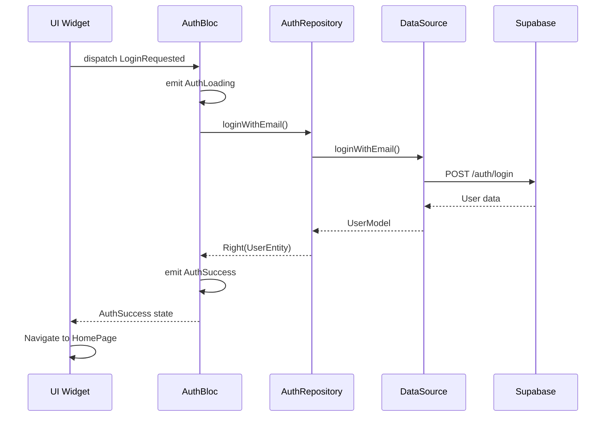

## What is Clean Architecture?

Clean Architecture separates code into **three concentric layers**, with dependencies flowing inward. This makes the codebase:

- **Testable**: Business logic can be tested without UI or database
- **Independent**: UI and database can be swapped without breaking core logic
- **Maintainable**: Changes in one layer don't cascade to others

## The Three Layers

```
┌─────────────────────────────────────┐
│      PRESENTATION LAYER             │
│   (BLoC, Pages, Widgets)            │
│   - Handles UI and user interaction │
│   - Dispatches events to BLoC       │
│   - Listens to state changes        │
└────────────┬────────────────────────┘
             │ depends on ↓
┌────────────▼────────────────────────┐
│       DOMAIN LAYER                  │
│   (Entities, Repository Interfaces) │
│   - Pure business logic             │
│   - No dependencies on frameworks   │
│   - Defines contracts (interfaces)  │
└────────────┬────────────────────────┘
             │ implemented by ↓
┌────────────▼────────────────────────┐
│        DATA LAYER                   │
│   (Models, DataSources, Repo Impl)  │
│   - Talks to external APIs          │
│   - Implements domain contracts     │
│   - Handles data transformation     │
└─────────────────────────────────────┘
```

<Warning>
  **Dependency Rule**: Dependencies ONLY point inward. The domain layer should never import from data or presentation layers.
</Warning>

## Domain Layer (Business Logic)

The domain layer contains pure Dart code with zero framework dependencies.

### Entities

Entities are simple data classes representing business objects:

```dart lib/features/auth/domain/entities/user_entity.dart
import 'package:equatable/equatable.dart';

class UserEntity extends Equatable {
  final String id;
  final String email;
  final String username;
  final String? avatarUrl;

  const UserEntity({
    required this.id,
    required this.email,
    required this.username,
    this.avatarUrl,
  });

  @override
  List<Object?> get props => [id, email, username, avatarUrl];
}
```

<Note>
  Entities use **Equatable** for easy comparison. This is crucial for BLoC state management.
</Note>

### Repository Interfaces

Repositories define **contracts** for data operations. They use `Either` from the `dartz` package to handle errors elegantly:

```dart lib/features/auth/domain/repositories/auth_repository.dart
import 'package:dartz/dartz.dart';
import '../../../../core/errors/failures.dart';
import '../entities/user_entity.dart';
import '../entities/profile_entity.dart';

abstract class AuthRepository {
  // Either<Failure, UserEntity> means:
  // "This returns EITHER a Failure (left) OR a UserEntity (right)"
  Future<Either<Failure, UserEntity>> loginWithEmail({
    required String email,
    required String password,
  });

  Future<Either<Failure, UserEntity>> registerWithEmail({
    required String email,
    required String password,
    required String username,
  });

  Future<Either<Failure, ProfileEntity>> getCurrentProfile();
  Future<void> addXp(int amount);
  Future<void> logout();
}
```

<Tip>
  The `Either` type forces you to handle both success and failure cases, preventing unhandled errors.
</Tip>

## Data Layer (Implementation)

The data layer implements the domain contracts and communicates with external services.

### Models

Models extend entities and add serialization logic:

```dart lib/features/auth/data/models/user_model.dart
import 'package:supabase_flutter/supabase_flutter.dart';
import '../../domain/entities/user_entity.dart';

class UserModel extends UserEntity {
  const UserModel({
    required super.id,
    required super.email,
    required super.username,
    super.avatarUrl,
  });

  // Factory: Creates a UserModel from Supabase User object
  factory UserModel.fromSupabaseUser(User user) {
    return UserModel(
      id: user.id,
      email: user.email ?? '',
      username: user.userMetadata?['username'] ?? 'Estudiante',
      avatarUrl: user.userMetadata?['avatar_url'],
    );
  }

  // Factory: Creates a UserModel from JSON
  factory UserModel.fromJson(Map<String, dynamic> json) {
    return UserModel(
      id: json['id'],
      email: json['email'],
      username: json['username'],
      avatarUrl: json['avatar_url'],
    );
  }
}
```

### Data Sources

Data sources handle direct communication with APIs:

```dart lib/features/auth/data/datasources/auth_remote_data_source.dart
import 'package:supabase_flutter/supabase_flutter.dart';
import '../../../../core/errors/failures.dart';
import '../models/user_model.dart';

abstract class AuthRemoteDataSource {
  Future<UserModel> loginWithEmail(String email, String password);
  Future<UserModel> registerWithEmail(String email, String password, String username);
  Future<void> logout();
}

class AuthRemoteDataSourceImpl implements AuthRemoteDataSource {
  final SupabaseClient supabaseClient;

  AuthRemoteDataSourceImpl({required this.supabaseClient});

  @override
  Future<UserModel> loginWithEmail(String email, String password) async {
    try {
      final response = await supabaseClient.auth.signInWithPassword(
        email: email,
        password: password,
      );

      if (response.user == null) {
        throw const ServerFailure('User is null after login');
      }

      return UserModel.fromSupabaseUser(response.user!);
    } on AuthException catch (e) {
      throw ServerFailure(e.message);
    } catch (e) {
      throw const ServerFailure('Unknown error during login');
    }
  }
}
```

### Repository Implementation

Repository implementations bridge the domain and data layers:

```dart lib/features/auth/data/repositories/auth_repository_impl.dart
import 'package:dartz/dartz.dart';
import '../../../../core/errors/failures.dart';
import '../../domain/entities/user_entity.dart';
import '../../domain/repositories/auth_repository.dart';
import '../datasources/auth_remote_data_source.dart';

class AuthRepositoryImpl implements AuthRepository {
  final AuthRemoteDataSource remoteDataSource;

  AuthRepositoryImpl({required this.remoteDataSource});

  @override
  Future<Either<Failure, UserEntity>> loginWithEmail({
    required String email,
    required String password,
  }) async {
    try {
      final user = await remoteDataSource.loginWithEmail(email, password);
      // Success: Return the RIGHT side with the user
      return Right(user);
    } on Failure catch (e) {
      // Known failure: Return the LEFT side with the error
      return Left(e);
    } catch (e) {
      return const Left(ServerFailure('Unexpected error in repository'));
    }
  }
}
```

<Note>
  **Why the extra layer?** Repositories let you switch data sources (e.g., from REST to GraphQL) without changing business logic.
</Note>

## Presentation Layer (UI)

The presentation layer handles user interaction and displays data.

### BLoC (State Management)

BLoCs receive events from the UI and emit states. See the [State Management](/development/state-management) page for details:

```dart lib/features/auth/presentation/bloc/auth_bloc.dart
class AuthBloc extends Bloc<AuthEvent, AuthState> {
  final AuthRepository authRepository;

  AuthBloc({required this.authRepository}) : super(AuthInitial()) {
    on<LoginRequested>((event, emit) async {
      emit(AuthLoading());

      final result = await authRepository.loginWithEmail(
        email: event.email,
        password: event.password,
      );

      result.fold(
        (failure) => emit(AuthFailure(failure.message)),
        (user) => emit(AuthSuccess(user)),
      );
    });
  }
}
```

### Pages and Widgets

Pages use BLoC to react to state changes:

```dart lib/features/auth/presentation/pages/login_page.dart
BlocListener<AuthBloc, AuthState>(
  listener: (context, state) {
    if (state is AuthSuccess) {
      // Navigate to home
      Navigator.pushReplacement(
        context,
        MaterialPageRoute(builder: (_) => const HomePage()),
      );
    } else if (state is AuthFailure) {
      // Show error
      ScaffoldMessenger.of(context).showSnackBar(
        SnackBar(content: Text(state.message)),
      );
    }
  },
  child: // ... UI widgets
)
```

## Real Example: Home Feature

Let's trace a document upload through all layers:

<Steps>
  <Step title="User taps 'Upload PDF' button">
    Widget dispatches `UploadDocumentEvent` to HomeBloc
  </Step>
  
  <Step title="HomeBloc processes event">
    ```dart
    on<UploadDocumentEvent>((event, emit) async {
      emit(HomeLoading());
      final result = await homeRepository.uploadDocument(
        event.file, 
        event.fileName
      );
      result.fold(
        (failure) => emit(HomeError(failure.message)),
        (document) => emit(DocumentUploaded(document)),
      );
    });
    ```
  </Step>
  
  <Step title="HomeRepository calls data source">
    ```dart
    // Repository implementation
    @override
    Future<Either<Failure, DocumentEntity>> uploadDocument(
      File file, 
      String fileName
    ) async {
      try {
        final doc = await remoteDataSource.uploadDocument(file, fileName);
        return Right(doc);
      } catch (e) {
        return Left(ServerFailure(e.toString()));
      }
    }
    ```
  </Step>
  
  <Step title="DataSource uploads to Supabase">
    ```dart
    @override
    Future<DocumentModel> uploadDocument(File file, String fileName) async {
      final storagePath = '${user.id}/$uniqueName';
      
      // Upload to Supabase Storage
      await supabaseClient.storage.from('pdfs').upload(storagePath, file);
      
      // Get public URL
      final publicUrl = supabaseClient.storage.from('pdfs')
        .getPublicUrl(storagePath);
      
      // Save reference in database
      final response = await supabaseClient.from('documents').insert({
        'user_id': user.id,
        'title': fileName,
        'file_url': publicUrl,
        'status': 'processing',
      }).select().single();
      
      return DocumentModel.fromJson(response);
    }
    ```
  </Step>
  
  <Step title="Result flows back through layers">
    DocumentModel → Repository → BLoC → State
  </Step>
  
  <Step title="UI rebuilds">
    Widget listens to `DocumentUploaded` state and shows success message
  </Step>
</Steps>

## Data Flow Diagram



## Benefits of This Architecture

<AccordionGroup>
  <Accordion title="Easy Testing">
    You can test business logic without Flutter:
    
    ```dart
    test('should return UserEntity on successful login', () async {
      // Mock the repository
      when(mockRepository.loginWithEmail(
        email: 'test@test.com',
        password: 'password'
      )).thenAnswer((_) async => Right(testUser));
      
      // Test the BLoC
      authBloc.add(LoginRequested(
        email: 'test@test.com',
        password: 'password'
      ));
      
      await expectLater(
        authBloc.stream,
        emitsInOrder([AuthLoading(), AuthSuccess(testUser)])
      );
    });
    ```
  </Accordion>
  
  <Accordion title="Swappable Dependencies">
    Want to switch from Supabase to Firebase? Just create a new DataSource implementation. The domain and presentation layers don't need to change.
  </Accordion>
  
  <Accordion title="Clear Responsibilities">
    - **Domain**: "What" the app does
    - **Data**: "Where" the data comes from
    - **Presentation**: "How" it looks to the user
  </Accordion>
  
  <Accordion title="Scalability">
    Adding new features follows the same pattern. Each feature is isolated in its own folder structure.
  </Accordion>
</AccordionGroup>

## Common Pitfalls

<Warning>
  **Don't break the dependency rule!** Never import from an outer layer:
  
  ```dart
  // ❌ BAD: Domain importing from data
  import '../../data/models/user_model.dart'; // in domain layer
  
  // ✅ GOOD: Data importing from domain
  import '../../domain/entities/user_entity.dart'; // in data layer
  ```
</Warning>

<Warning>
  **Don't put business logic in BLoCs!** BLoCs should orchestrate, not implement business rules. Complex logic belongs in use cases or the domain layer.
</Warning>

## Next Steps

<CardGroup cols={2}>
  <Card title="State Management" icon="diagram-project" href="/development/state-management">
    Learn how to use BLoC for state management
  </Card>
  
  <Card title="Supabase Integration" icon="database" href="/development/supabase-integration">
    Implement data sources with Supabase
  </Card>
</CardGroup>
