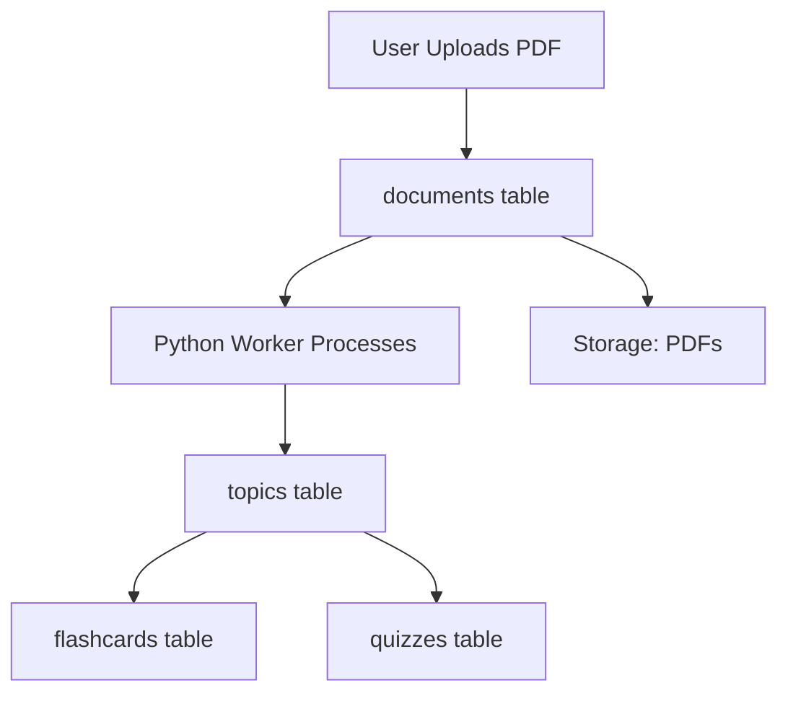

## Overview

StudyQuest uses Supabase as its backend platform, providing:

- **Authentication**: Secure user accounts with email/password
- **Database**: PostgreSQL for storing documents, topics, flashcards, and quizzes
- **Storage**: PDF file storage with user-scoped access
- **Real-time**: Live updates for AI processing status

<Note>
  You'll need a Supabase account. The free tier is sufficient for development and small-scale production use. [Sign up at supabase.com](https://supabase.com)
</Note>

## Create Supabase Project

<Steps>
  <Step title="Sign Up or Log In">
    Go to [app.supabase.com](https://app.supabase.com) and create an account or sign in.
  </Step>
  
  <Step title="Create New Project">
    1. Click **New Project**
    2. Choose your organization (or create one)
    3. Enter project details:
       - **Name**: StudyQuest (or your preferred name)
       - **Database Password**: Generate a strong password
       - **Region**: Choose closest to your users
       - **Pricing Plan**: Free (or Pro if needed)
    4. Click **Create new project**
    
    <Warning>
      Save your database password! You'll need it if you ever want to connect directly to PostgreSQL.
    </Warning>
  </Step>
  
  <Step title="Get API Credentials">
    Once the project is created:
    
    1. Go to **Settings > API**
    2. Note these values:
       - **Project URL**: Your Supabase endpoint
       - **anon/public key**: For the Flutter app
       - **service_role key**: For the Python worker
    
    <Tip>
      Copy these to your configuration files as described in the [Configuration Guide](/setup/configuration).
    </Tip>
  </Step>
</Steps>

## Database Schema Setup

Create the database tables needed by StudyQuest.

### Core Tables

<Steps>
  <Step title="Open SQL Editor">
    In your Supabase dashboard, navigate to **Database > SQL Editor**.
  </Step>
  
  <Step title="Run Schema SQL">
    Copy and paste this SQL to create all tables:
    
    ```sql
    -- Enable UUID extension
    CREATE EXTENSION IF NOT EXISTS "uuid-ossp";

    -- Documents table: Stores uploaded PDF files
    CREATE TABLE documents (
      id UUID PRIMARY KEY DEFAULT uuid_generate_v4(),
      user_id UUID REFERENCES auth.users(id) ON DELETE CASCADE NOT NULL,
      title TEXT NOT NULL,
      file_url TEXT NOT NULL,
      summary_text TEXT,
      status TEXT DEFAULT 'processing' CHECK (status IN ('processing', 'ready', 'error')),
      created_at TIMESTAMP WITH TIME ZONE DEFAULT NOW(),
      updated_at TIMESTAMP WITH TIME ZONE DEFAULT NOW()
    );

    -- Topics table: AI-generated topics from documents
    CREATE TABLE topics (
      id UUID PRIMARY KEY DEFAULT uuid_generate_v4(),
      document_id UUID REFERENCES documents(id) ON DELETE CASCADE NOT NULL,
      title TEXT NOT NULL,
      description TEXT,
      order_index INTEGER DEFAULT 0,
      created_at TIMESTAMP WITH TIME ZONE DEFAULT NOW()
    );

    -- Flashcards table: Question-answer pairs for each topic
    CREATE TABLE flashcards (
      id UUID PRIMARY KEY DEFAULT uuid_generate_v4(),
      document_id UUID REFERENCES documents(id) ON DELETE CASCADE NOT NULL,
      topic_id UUID REFERENCES topics(id) ON DELETE CASCADE NOT NULL,
      front_text TEXT NOT NULL,
      back_text TEXT NOT NULL,
      mastery_level INTEGER DEFAULT 1 CHECK (mastery_level >= 1 AND mastery_level <= 5),
      created_at TIMESTAMP WITH TIME ZONE DEFAULT NOW()
    );

    -- Quizzes table: Multiple-choice questions for each topic
    CREATE TABLE quizzes (
      id UUID PRIMARY KEY DEFAULT uuid_generate_v4(),
      document_id UUID REFERENCES documents(id) ON DELETE CASCADE NOT NULL,
      topic_id UUID REFERENCES topics(id) ON DELETE CASCADE NOT NULL,
      question_text TEXT NOT NULL,
      options JSONB NOT NULL,
      correct_answer_index INTEGER NOT NULL,
      explanation TEXT,
      created_at TIMESTAMP WITH TIME ZONE DEFAULT NOW()
    );

    -- User profiles table (optional, for gamification)
    CREATE TABLE user_profiles (
      id UUID PRIMARY KEY REFERENCES auth.users(id) ON DELETE CASCADE,
      username TEXT UNIQUE,
      avatar_url TEXT,
      total_xp INTEGER DEFAULT 0,
      level INTEGER DEFAULT 1,
      streak_days INTEGER DEFAULT 0,
      last_study_date DATE,
      created_at TIMESTAMP WITH TIME ZONE DEFAULT NOW(),
      updated_at TIMESTAMP WITH TIME ZONE DEFAULT NOW()
    );

    -- Indexes for performance
    CREATE INDEX idx_documents_user_id ON documents(user_id);
    CREATE INDEX idx_documents_status ON documents(status);
    CREATE INDEX idx_topics_document_id ON topics(document_id);
    CREATE INDEX idx_flashcards_topic_id ON flashcards(topic_id);
    CREATE INDEX idx_quizzes_topic_id ON quizzes(topic_id);
    ```
    
    Click **Run** to execute the SQL.
  </Step>
  
  <Step title="Verify Tables Created">
    Check the **Table Editor** to see all tables:
    
    - documents
    - topics
    - flashcards
    - quizzes
    - user_profiles
  </Step>
</Steps>

### Understanding the Schema

Here's how the data flows through the system:



**Documents Entity** (lib/features/home/domain/entities/document_entity.dart:1-22):

```dart
class DocumentEntity extends Equatable {
  final String id;
  final String title;
  final String fileUrl;
  final String? summary; // AI-generated summary
  final String status;   // 'processing', 'ready', 'error'
  final DateTime uploadDate;

  const DocumentEntity({
    required this.id,
    required this.title,
    required this.fileUrl,
    this.summary,
    required this.status,
    required this.uploadDate,
  });
}
```

**Flashcard Entity** (lib/features/home/domain/entities/flashcard_entity.dart:1-20):

```dart
class FlashcardEntity {
  final String id;
  final String front; // Question
  final String back;  // Answer

  FlashcardEntity({
    required this.id,
    required this.front,
    required this.back,
  });

  factory FlashcardEntity.fromMap(Map<String, dynamic> map) {
    return FlashcardEntity(
      id: map['id'] as String,
      front: map['front_text'] ?? 'Sin texto',
      back: map['back_text'] ?? 'Sin respuesta',
    );
  }
}
```

**Quiz Entity** (lib/features/home/domain/entities/quiz_entity.dart:1-26):

```dart
class QuizEntity {
  final String id;
  final String question;
  final List<String> options;
  final int correctIndex;
  final String explanation;

  QuizEntity({
    required this.id,
    required this.question,
    required this.options,
    required this.correctIndex,
    required this.explanation,
  });

  factory QuizEntity.fromMap(Map<String, dynamic> map) {
    return QuizEntity(
      id: map['id'] as String,
      question: map['question_text'] ?? 'Sin pregunta',
      options: List<String>.from(map['options'] ?? []),
      correctIndex: map['correct_answer_index'] as int,
      explanation: map['explanation'] ?? '',
    );
  }
}
```

## Row Level Security (RLS)

Enable Row Level Security to protect user data:

<Steps>
  <Step title="Enable RLS on All Tables">
    ```sql
    ALTER TABLE documents ENABLE ROW LEVEL SECURITY;
    ALTER TABLE topics ENABLE ROW LEVEL SECURITY;
    ALTER TABLE flashcards ENABLE ROW LEVEL SECURITY;
    ALTER TABLE quizzes ENABLE ROW LEVEL SECURITY;
    ALTER TABLE user_profiles ENABLE ROW LEVEL SECURITY;
    ```
  </Step>
  
  <Step title="Create Policies for Documents">
    Users can only view and insert their own documents:
    
    ```sql
    -- Users can view their own documents
    CREATE POLICY "Users can view own documents" ON documents
      FOR SELECT
      USING (auth.uid() = user_id);
    
    -- Users can insert their own documents
    CREATE POLICY "Users can insert own documents" ON documents
      FOR INSERT
      WITH CHECK (auth.uid() = user_id);
    
    -- Users can update their own documents
    CREATE POLICY "Users can update own documents" ON documents
      FOR UPDATE
      USING (auth.uid() = user_id);
    
    -- Users can delete their own documents
    CREATE POLICY "Users can delete own documents" ON documents
      FOR DELETE
      USING (auth.uid() = user_id);
    ```
  </Step>
  
  <Step title="Create Policies for Related Tables">
    Topics, flashcards, and quizzes inherit access from documents:
    
    ```sql
    -- Topics: Access based on document ownership
    CREATE POLICY "Users can view topics from own documents" ON topics
      FOR SELECT
      USING (
        EXISTS (
          SELECT 1 FROM documents 
          WHERE documents.id = topics.document_id 
          AND documents.user_id = auth.uid()
        )
      );
    
    -- Flashcards: Access based on document ownership
    CREATE POLICY "Users can view flashcards from own documents" ON flashcards
      FOR SELECT
      USING (
        EXISTS (
          SELECT 1 FROM documents 
          WHERE documents.id = flashcards.document_id 
          AND documents.user_id = auth.uid()
        )
      );
    
    -- Quizzes: Access based on document ownership
    CREATE POLICY "Users can view quizzes from own documents" ON quizzes
      FOR SELECT
      USING (
        EXISTS (
          SELECT 1 FROM documents 
          WHERE documents.id = quizzes.document_id 
          AND documents.user_id = auth.uid()
        )
      );
    
    -- User profiles: Users can only view and update their own profile
    CREATE POLICY "Users can view own profile" ON user_profiles
      FOR SELECT
      USING (auth.uid() = id);
    
    CREATE POLICY "Users can update own profile" ON user_profiles
      FOR UPDATE
      USING (auth.uid() = id);
    ```
  </Step>
  
  <Step title="Service Role Bypass">
    The Python worker uses the service_role key which bypasses RLS, allowing it to insert topics, flashcards, and quizzes for any document.
    
    <Warning>
      Never expose the service_role key in client-side code. Only use it in the backend worker.
    </Warning>
  </Step>
</Steps>

## Storage Configuration

Set up storage for PDF files:

<Steps>
  <Step title="Create Storage Bucket">
    1. Go to **Storage** in the Supabase dashboard
    2. Click **Create bucket**
    3. Name it `pdfs`
    4. Set **Public bucket**: OFF (for security)
    5. Click **Create bucket**
  </Step>
  
  <Step title="Configure Bucket Policies">
    Set up access policies for the bucket:
    
    1. Click on the `pdfs` bucket
    2. Go to **Policies**
    3. Add these policies:
    
    **Allow authenticated users to upload:**
    ```sql
    CREATE POLICY "Authenticated users can upload"
    ON storage.objects FOR INSERT
    TO authenticated
    WITH CHECK (bucket_id = 'pdfs' AND auth.uid()::text = (storage.foldername(name))[1]);
    ```
    
    **Allow users to access their own files:**
    ```sql
    CREATE POLICY "Users can access own files"
    ON storage.objects FOR SELECT
    TO authenticated
    USING (bucket_id = 'pdfs' AND auth.uid()::text = (storage.foldername(name))[1]);
    ```
    
    This ensures users can only access files in their own folder (`user_id/filename.pdf`).
  </Step>
  
  <Step title="Test Upload from App">
    The app uploads files using this code:
    
    ```dart lib/features/home/data/datasources/home_remote_data_source.dart
    Future<DocumentModel> uploadDocument(File file, String fileName) async {
      final user = supabaseClient.auth.currentUser;
      if (user == null) throw const ServerFailure("Usuario no autenticado");

      // 1. Upload file to Storage (Bucket 'pdfs')
      // Path: user_id/timestamp_nombre.pdf
      final fileExt = fileName.split('.').last;
      final uniqueName = '${DateTime.now().millisecondsSinceEpoch}.$fileExt';
      final storagePath = '${user.id}/$uniqueName';

      await supabaseClient.storage.from('pdfs').upload(
            storagePath,
            file,
            fileOptions: const FileOptions(cacheControl: '3600', upsert: false),
          );

      // 2. Get public URL
      final publicUrl = supabaseClient.storage.from('pdfs').getPublicUrl(storagePath);

      // 3. Save reference in Database
      final response = await supabaseClient.from('documents').insert({
        'user_id': user.id,
        'title': fileName,
        'file_url': publicUrl,
        'status': 'processing',
      }).select().single();

      return DocumentModel.fromJson(response);
    }
    ```
  </Step>
</Steps>

## Python Worker Setup

The Python worker monitors Supabase for new documents and processes them with AI.

### Install Dependencies

<Steps>
  <Step title="Create Virtual Environment">
    ```bash
    cd backend
    python -m venv venv
    ```
  </Step>
  
  <Step title="Activate Virtual Environment">
    <CodeGroup>
    ```bash macOS/Linux
    source venv/bin/activate
    ```
    
    ```bash Windows (CMD)
    venv\Scripts\activate.bat
    ```
    
    ```bash Windows (PowerShell)
    venv\Scripts\Activate.ps1
    ```
    </CodeGroup>
  </Step>
  
  <Step title="Install Required Packages">
    ```bash
    pip install -r requirements.txt
    ```
    
    This installs:
    
    ```txt backend/requirements.txt
    supabase
    google-generativeai
    pypdf
    python-dotenv
    ```
  </Step>
</Steps>

### Configure Worker

<Steps>
  <Step title="Create .env File">
    Create `backend/.env` with your credentials:
    
    ```bash backend/.env
    SUPABASE_URL=https://your-project.supabase.co
    SUPABASE_KEY=your-service-role-key
    GEMINI_API_KEY=your-gemini-api-key
    ```
    
    <Warning>
      Use the **service_role key**, not the anon key. The worker needs full database access to insert generated content.
    </Warning>
  </Step>
  
  <Step title="Test Worker Locally">
    Run the worker to ensure it connects:
    
    ```bash
    python worker.py
    ```
    
    You should see:
    
    ```
    🤖 StudyQuest AI Worker (V4 - Auto-Nombramiento) iniciado...
    Esperando documentos en la cola...
    ```
    
    <Tip>
      Leave the worker running while testing the app. When you upload a PDF, you'll see the processing logs in real-time.
    </Tip>
  </Step>
</Steps>

### How the Worker Processes Documents

The worker follows this flow:

```python backend/worker.py
def main():
    print("🤖 StudyQuest AI Worker (V4 - Auto-Nombramiento) iniciado...")
    print("Esperando documentos en la cola...")
    
    while True:
        try:
            # 1. Check for documents with status='processing'
            response = supabase.table('documents').select("*").eq('status', 'processing').execute()
            documents = response.data if hasattr(response, 'data') else response
            
            if documents and len(documents) > 0:
                for doc in documents:
                    process_document(doc)
            else:
                time.sleep(5)  # Wait 5 seconds before checking again
                
        except Exception as e:
            print(f"Error de conexión en el loop principal: {e}")
            time.sleep(10)
```

The `process_document` function:

1. **Downloads the PDF** from Storage
2. **Extracts text** from all pages
3. **Generates context** (title and summary)
4. **Chunks the text** into manageable pieces
5. **Analyzes each chunk** with Gemini AI to extract topics
6. **Saves topics, flashcards, and quizzes** to the database
7. **Updates document status** to 'ready'

```python backend/worker.py
def process_document(doc):
    doc_id = doc['id']
    print(f"\n🚀 Procesando documento: {doc['title']} ({doc_id})")
    
    try:
        # 1. Extract all text from PDF
        full_text = extract_all_text_from_pdf(doc['file_url'])
        
        # 2. Generate title and summary
        global_context = generate_global_context(full_text)
        short_title = global_context.get("short_title", "Nuevo Mundo")
        global_summary = global_context.get("summary", "Resumen no disponible.")
        
        # 3. Chunk the text
        chunk_size = 25000 
        chunks = [full_text[i:i+chunk_size] for i in range(0, len(full_text), chunk_size)]
        
        print(f"   ✂️ Documento dividido en {len(chunks)} bloques lógicos.")
        
        all_topics = []
        
        # 4. Process each chunk with AI
        for i, chunk in enumerate(chunks):
            if i > 0: time.sleep(2)  # Rate limiting
            
            ai_data = generate_content_for_chunk(chunk, i + 1)
            
            if 'topics' in ai_data:
                for topic in ai_data['topics']:
                    if len(topic.get('flashcards', [])) > 0 or len(topic.get('quizzes', [])) > 0:
                        all_topics.append(topic)
        
        # 5. Save to database
        for index, topic_data in enumerate(all_topics):
            topic_response = supabase.table('topics').insert({
                'document_id': doc_id,
                'title': topic_data['title'],
                'description': topic_data.get('description', ''),
                'order_index': index
            }).execute()
            
            topic_id = topic_response.data[0]['id']
            
            # Insert flashcards
            if 'flashcards' in topic_data:
                flashcards_to_insert = [
                    {
                        'document_id': doc_id,
                        'topic_id': topic_id,
                        'front_text': fc['front'],
                        'back_text': fc['back'],
                        'mastery_level': 1
                    }
                    for fc in topic_data['flashcards']
                ]
                if flashcards_to_insert:
                    supabase.table('flashcards').insert(flashcards_to_insert).execute()
            
            # Insert quizzes
            if 'quizzes' in topic_data:
                quizzes_to_insert = [
                    {
                        'document_id': doc_id,
                        'topic_id': topic_id,
                        'question_text': q['question'],
                        'options': q['options'],
                        'correct_answer_index': q['correct_index'],
                        'explanation': q.get('explanation', '')
                    }
                    for q in topic_data['quizzes']
                ]
                if quizzes_to_insert:
                    supabase.table('quizzes').insert(quizzes_to_insert).execute()
        
        # 6. Update document status
        supabase.table('documents').update({
            'title': short_title,
            'status': 'ready',
            'summary_text': global_summary
        }).eq('id', doc_id).execute()
        
        print("🎉 ¡Proceso completado con éxito! El mundo está listo para jugarse.")

    except Exception as e:
        print(f"❌ Error crítico procesando documento {doc_id}: {e}")
        supabase.table('documents').update({'status': 'error'}).eq('id', doc_id).execute()
```

## Deploy the Worker

For production, deploy the worker to a cloud platform:

<Tabs>
  <Tab title="Railway">
    1. Push your code to GitHub
    2. Go to [railway.app](https://railway.app)
    3. Create a new project from your repo
    4. Add environment variables in Railway dashboard
    5. Deploy
    
    ```bash
    # Add Procfile
    echo "worker: python backend/worker.py" > Procfile
    ```
  </Tab>
  
  <Tab title="Render">
    1. Go to [render.com](https://render.com)
    2. Create a new Background Worker
    3. Connect your GitHub repo
    4. Set:
       - **Build Command**: `pip install -r backend/requirements.txt`
       - **Start Command**: `python backend/worker.py`
    5. Add environment variables
    6. Deploy
  </Tab>
  
  <Tab title="Heroku">
    ```bash
    # Install Heroku CLI
    heroku login
    
    # Create app
    heroku create studyquest-worker
    
    # Set environment variables
    heroku config:set SUPABASE_URL=your-url
    heroku config:set SUPABASE_KEY=your-key
    heroku config:set GEMINI_API_KEY=your-key
    
    # Deploy
    git push heroku main
    ```
  </Tab>
  
  <Tab title="Docker">
    Create `backend/Dockerfile`:
    
    ```dockerfile
    FROM python:3.11-slim
    
    WORKDIR /app
    
    COPY requirements.txt .
    RUN pip install --no-cache-dir -r requirements.txt
    
    COPY . .
    
    CMD ["python", "worker.py"]
    ```
    
    Build and run:
    ```bash
    docker build -t studyquest-worker ./backend
    docker run --env-file backend/.env studyquest-worker
    ```
  </Tab>
</Tabs>

<Warning>
  Ensure environment variables are set in your deployment platform. Never commit `.env` files to version control.
</Warning>

## Verify Everything Works

<Steps>
  <Step title="Test Authentication">
    Sign up a user in the Flutter app and verify the account appears in Supabase:
    
    **Authentication > Users** in the dashboard
  </Step>
  
  <Step title="Upload a Test PDF">
    Upload a PDF in the app and verify:
    
    1. File appears in **Storage > pdfs**
    2. Document record created in **Table Editor > documents** with status='processing'
  </Step>
  
  <Step title="Monitor Worker Processing">
    Check the worker logs to see:
    
    ```
    🚀 Procesando documento: test.pdf (uuid)
       ⬇️ Descargando PDF completo...
       📖 Leyendo PDF...
       🧠 IA Analizando bloque 1...
       📑 IA encontró un total de 5 temas
    🎉 ¡Proceso completado con éxito!
    ```
  </Step>
  
  <Step title="Verify Generated Content">
    In Supabase Table Editor, check:
    
    - **topics**: AI-generated topics
    - **flashcards**: Questions and answers
    - **quizzes**: Multiple-choice questions
    - **documents**: Status changed to 'ready'
  </Step>
  
  <Step title="Test in App">
    Open the processed document in the app and verify you can:
    
    - View topics
    - Study flashcards
    - Take quizzes
  </Step>
</Steps>

## Troubleshooting

<AccordionGroup>
  <Accordion title="Documents stuck in 'processing' status">
    **Cause**: Worker not running or crashed
    
    **Solution**:
    1. Check if worker is running: `ps aux | grep worker.py`
    2. Restart worker: `python worker.py`
    3. Check worker logs for errors
    4. Verify environment variables are set
  </Accordion>
  
  <Accordion title="Worker can't download PDFs">
    **Cause**: Storage permissions or invalid URLs
    
    **Solution**:
    1. Verify storage bucket exists and is named 'pdfs'
    2. Check file URLs in documents table are accessible
    3. Ensure storage policies allow access
    4. Try manually downloading a file URL
  </Accordion>
  
  <Accordion title="AI generates empty topics">
    **Cause**: PDF is image-based (scanned) or has no extractable text
    
    **Solution**:
    1. Test with a text-based PDF
    2. Check worker logs for "PDF parece estar vacío"
    3. Use PDFs with selectable text, not scanned images
    4. Consider adding OCR support for scanned PDFs
  </Accordion>
  
  <Accordion title="RLS blocks legitimate queries">
    **Cause**: Policies too restrictive or incorrectly configured
    
    **Solution**:
    1. Test queries in SQL Editor as authenticated user
    2. Check policy conditions match your query
    3. Temporarily disable RLS to test: `ALTER TABLE table_name DISABLE ROW LEVEL SECURITY;`
    4. Re-enable after debugging
  </Accordion>
</AccordionGroup>

## Next Steps

<CardGroup cols={2}>
  <Card title="Start Building" icon="code" href="/quickstart">
    Follow the quickstart to run the complete app
  </Card>
  
  <Card title="Supabase Integration" icon="database" href="/development/supabase-integration">
    Learn how the app integrates with Supabase
  </Card>
  
  <Card title="AI Worker" icon="robot" href="/development/ai-worker">
    Understand the Python worker architecture
  </Card>
  
  <Card title="Clean Architecture" icon="layer-group" href="/development/clean-architecture">
    Explore the app's architectural patterns
  </Card>
</CardGroup>
